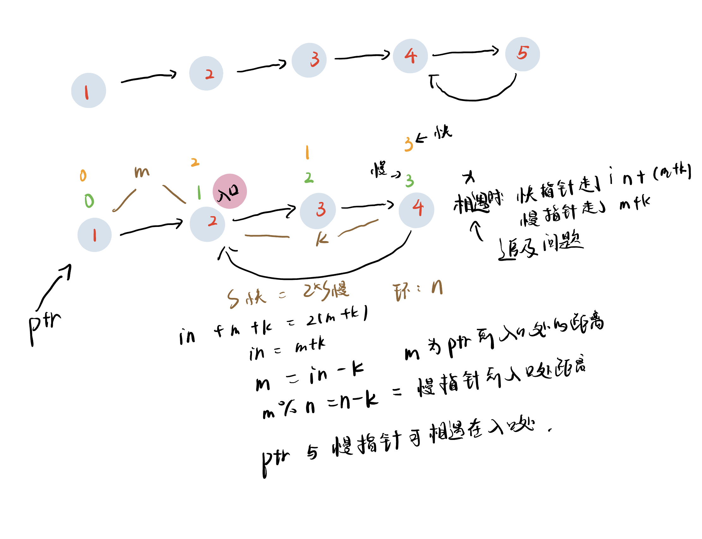

# 2022.6.19
## 题目：141. 环形链表

网址：https://leetcode.cn/problems/linked-list-cycle/

## 解法：
### 法一：O(N)，哈希
```cpp
/**
 * Definition for singly-linked list.
 * struct ListNode {
 *     int val;
 *     ListNode *next;
 *     ListNode(int x) : val(x), next(NULL) {}
 * };
 */
class Solution {
public:
    bool hasCycle(ListNode *head) {
        unordered_set<ListNode*> st;
        auto ptrnode = head;
        while(ptrnode!=nullptr){
            if(st.find(ptrnode)==st.end()){
                st.insert(ptrnode);
                ptrnode = ptrnode -> next;
            }else{
                return true;
            }
        }
        return false;
    }
};
```
### 法二：存储O(1),快慢指针
```cpp
/**
 * Definition for singly-linked list.
 * struct ListNode {
 *     int val;
 *     ListNode *next;
 *     ListNode(int x) : val(x), next(NULL) {}
 * };
 */
class Solution {
public:
    bool hasCycle(ListNode *head) {
        if(head == nullptr || head->next == nullptr)
        return true;
        auto fast=head,slow=head->next;
        while(fast != slow){
            fast = fast->next;
            if(fast == nullptr)return false;
            fast = fast->next;
            if(fast == nullptr)return false;
            slow = slow->next;
        }
        return true;
    }
};
```

## 题目：141. 环形链表

网址：https://leetcode.cn/problems/linked-list-cycle/

## 解法：
### 法一：O(N)，哈希


### 法二：存储空间：O(1)，快慢指针



```cpp
/**
 * Definition for singly-linked list.
 * struct ListNode {
 *     int val;
 *     ListNode *next;
 *     ListNode(int x) : val(x), next(NULL) {}
 * };
 */
class Solution {
public:
    ListNode *detectCycle(ListNode *head) {
        if(head == nullptr)return nullptr;
        auto fast = head,slow = head;
        //首先找到他们相遇的第一个位置
        //Sf = in + m + k,Ss = m + k
        while(fast!=nullptr){
            if(fast->next == nullptr || fast->next->next == nullptr)return nullptr;
            fast = fast -> next -> next;
            slow = slow->next;
            if(fast == slow)break;
        }
        //让快指针指向head
        fast = head;
        //快指针step改为1，寻找二者再次相遇的地方
        while(fast!=slow){
            fast=fast->next;
            slow=slow->next;
        }
        return slow;
    }
};
```

